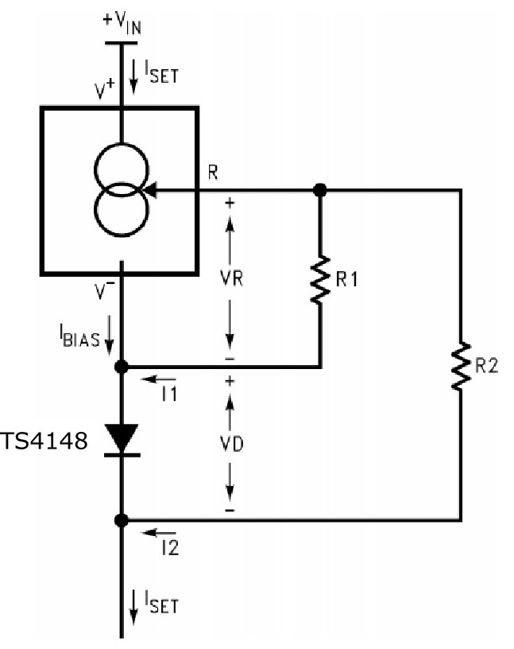

AC Amplifier
============

High-speed amplifier
--------------------

A high-speed feedback amplifier achieves closed loop control of the emitter coil current. By ensuring a stable alternating current amplitude exists it can be assumed that the associated time-varying magnetic field amplitude is constant too. The LM7171 high speed operational amplifier is used for this design. The amplifier circuit design is shown below.

* :math:`R_f` is the sense resistor (typically 1 ohm). The voltage dropped across this resistor is used as feedback for the amplifier
* :math:`L_t` and :math:`R_t` are the series resistance and inductance of the emitter coil. :math:`L_t` is typically 75 :math:`\mu H` for the square coil design. :math:`R_t` is typically 2.9 :math:`\Omega`
* :math:`R_c` and :math:`C_c` form a compensator network for the amplifier. This network maintains amplifier stability and prevents excessive ringing. Anser EMT uses an :math:`R_c` of 5 :math:`k \Omega` and :math:`C_c` of 70 :math:`nF`
* The current amplifier enables the amplifier to deliver the desired current to the emitter coil (described in the next section).

Details of how the compensation network impacts the operation of the circuit and the derivation of component values can be read in more depth [1]_ on page 91.

Current amplifier
-----------------

The current amplifier enables the LM7171 to deliver the required current to the transmitter coils. The design follows a standard push-pull class B amplifier design. The figure below shows the LM7171 high speed amplifier with addition of the class B current boost stage.

.. image:: _images/classb.png
  :scale: 80%
  :align: center

Transistor Q1 carries the main load current during positive cycles of the input waveform, while Q2 sinks current during the negative cycles. The current source and diode arrangement is used in order to bias the two transistors and to reduce crossover distortion as the conducting transistor switches from Q1 to Q2.

* The LM334 current sources provide a bias current to the amplifier
* Diode D1 and transistor Q1 form a pair. i.e. their base-emitter characteristics match (reasonably well). Likewise with D2 and Q2. This ensures a constant trickle bias and reduces cross-over distortion.
* Diodes used are IN4001 [2]_
* Transistors used are D44H8 (NPN) and D45H8 (PNP) [3]_

LM334 current bias
------------------

The LM334 provides a bias to the current amplifier circuit as seen above. The configuration of the LM334 is shown in the figure below. This is a modified figure taken from LM334 [4]_.

The LM334 is configured as a "Zero Temperature Coefficent Current Source". This means that the bias current is immune to ambient temperature changes and ensures the circuit operating point remains stationary.

.. [1] https://cora.ucc.ie/bitstream/handle/10468/2025/Thesis_Kilian_O_Donoghue.pdf?sequence=3&isAllowed=y
.. [2] http://www.diodes.com/downloads/5642
.. [3] http://www.onsemi.com/pub_link/Collateral/D44H-D.PDF
.. [4] http://www.ti.com/lit/ds/symlink/lm134.pdf