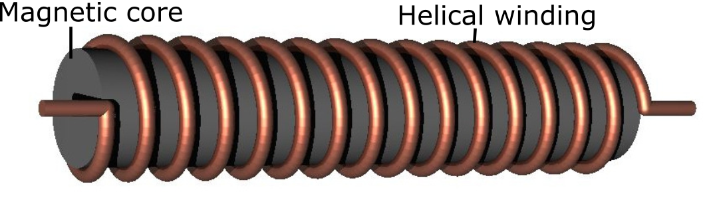

Tracking Sensor
===============

The tracking sensor produces a time-varying voltage signal when placed in the working volume of the tracking system. A sensor consists of a coil of wire that is typically wound around a magnetically permeable material. A diagram of the coil construction is shown below:

This voltage is induced according to faraday's law:

.. math::

  v_i(t) = -N\frac{d\Phi_{i}}{dt}

where :math:`N` is the number of coil turns and :math:`\Phi_{i}` is the magnetic flux intersecting the sensor due to the :math:`i^{th}` transmitter coil PCB. :math:`\frac{d\Phi_i}{dt}` depends on the position, orientation, core material and frequency of the emitter coil w.r.t. the sensor.

To derive the voltage across on the sensor in terms of system variables we first look at the magnetic field intensity :math:`\mathbf{H_i}` at a particular point in space due to a single PCB coil. This intensity is calculated from the PCB coil model described in section 3a and can be written as

.. math:: 

  \mathbf{H_i} = H_0\sin(\omega_i t)\mathbf{n_H}

where :math:`H_0` is the magnitude of the intensity, :math:`\omega_i` is the frequency of the time varying field and :math:`n_H` is a unit vector pointing in the direction of the field intensity. By placing a sensor at this point in space, the magnetic flux intersecting the sensor can be written as

.. math:: 
  \Phi_i = \mu_0\mu_r A H_0\sin(\omega_i t)\mathbf{n_H . n_A}

where :math:`\mu_0` and :math:`\mu_r` are absolute and relative permeabilities of free space and ferrite core respectively, :math:`A` is the cross sectional area of the sensor and :math:`n_A` is a unit vector pointing along the axis of the sensor. Multiplying by the number of turns :math:`N` and taking the time derivative results in

.. math:: 

  v_i(t) = \frac{d\Phi_i}{dt}= - \mu_0\mu_r A N  H_0 \omega_i\cos(\omega_i t)\mathbf{n_H . n_A}

The negative sign is added to satisfy Lenz's law. This equation highlights some important aspects of the system:

 - The magnitude of the induced voltage increases lineary with frequency :math:`\omega`
 - The voltage depends on the orientation of the sensor with respect the magnetic field. If the sensor is positioned such that its axis is perpendicular to the field direction :math:`\mathbf{n_H.n_A}=0` and no voltage is induced for a particular frequency.
 - The magnetic core of the sensor (in this case ferrite) has a significant impact on sensor gain. Depending on the type of ferrite used, relative permeabilities (:math:`\mu_r`) of up to 500 can be achieved.

Anser EMT utilises 8 transmitter PCB coils in total. Therefore the induced sensor voltage on the sensor is a superposition of voltages due to each of the 8 coils:

.. math::

  V(t) = \sum_{n=1}^8 v_i(t)

This amplitude of this composite signal is very weak (of the order of :math:`\mu V`) and requires significant amplification before sampling by the data acquisition system (DAQ).

---

The sensor that was used to test the Anser EMT was the NDI model 610099 5-DOF sensor. The sensor measures 0.5mm in diameter with a rigid tip of 8mm. The sensor has been electrically characterised with a DC resistance of ~ :math:`70\Omega` and series inductance of :math:`2\text{mH}`. A parasitic capacitance of :math:`900\text{pF}` is also present.  A photograph of the sensor shown below:

.. image:: _images/sensorphoto.png
  :scale: 50%
  :align: center

